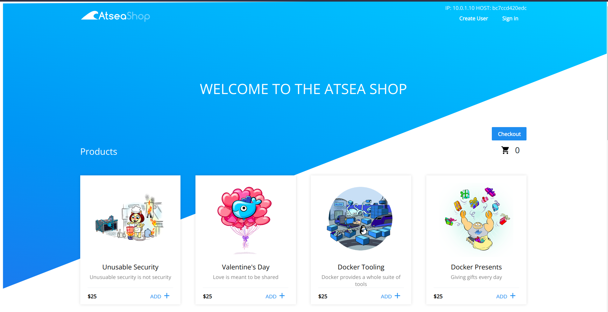
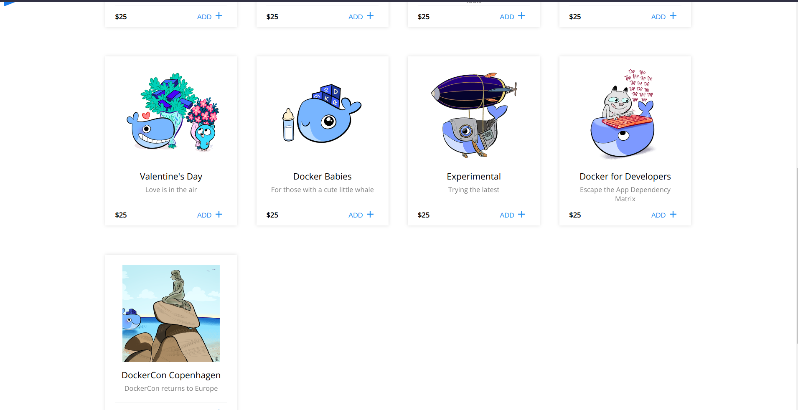
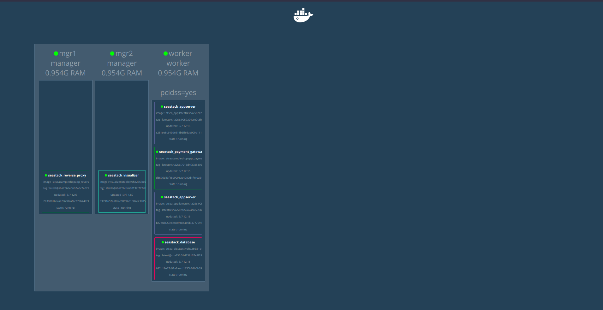

# docker-swarm-project

- setup vagrant machines:
  
        vgrant up
- run ansible playbook:
  
        ansible-playbook -i inventory/hosts docker-swarm.yaml
  
        

# atsea sample shop app

Repo: https://github.com/dockersamples/atsea-sample-shop-app

The URL for the content is `http://localhost:8001/`
